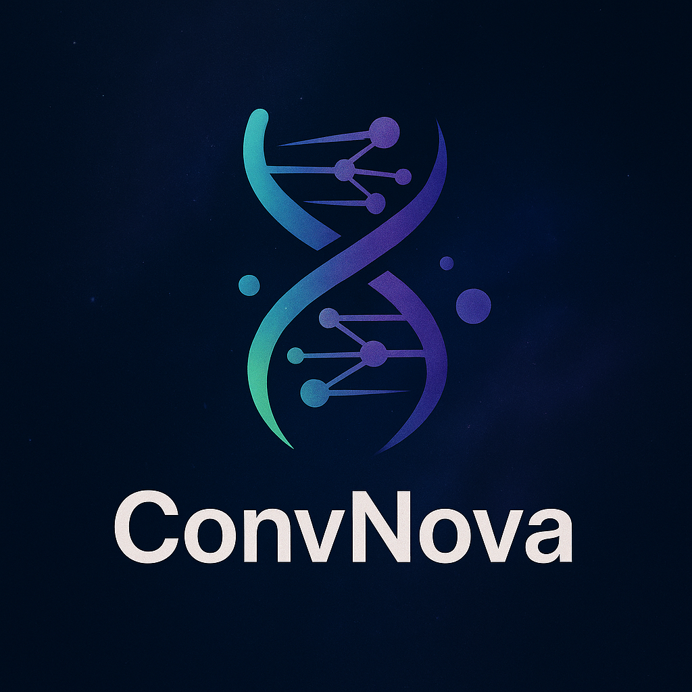

  

<h1>[ICLR2025] ConvNova 🧬 Revisiting Convolution Architecture in the Realm of DNA Foundation Models</h1>

  <a href="https://openreview.net/forum?id=B07dLVWLyD">OpenReview</a> | 
  <a href="https://arxiv.org/abs/2502.18538">arXiv</a> | 
  <a href="https://github.com/aim-uofa/ConvNova">GitHub</a> | 
  <a href="">HuggingFace 🤗(coming soon)</a>
<!--   <a href="https://huggingface.co/collections/convnova">HuggingFace 🤗</a> <!-- collection will be public on release day --> 

  ConvNova demonstrates that, if carefully designed, <strong>a pure CNN can serve as a DNA foundation model that surpasses Transformer and SSM-inspired architectures</strong>, while retaining the classic convolutional advantages of stronger locality bias, lower memory footprint, and markedly faster training and inference.

---

## 🚩 Plan
- [x] Scripts for Pretraining, NT & Genomic Benchmarks.
- [x] Paper Released.
- [ ] Pretrained Weights of ConvNova.
- [ ] Source Code and Pretrained Weights on transformers.
- [ ] Scripts for DeepSEA & Bend-gene-finding.

---

<h2>1 Quick start</h2>

Clone the repo.
<pre>
  git clone git@github.com:aim-uofa/ConvNova.git
  cd ConvNova/convnova
</pre>

Prepare conda env.
<pre>
  conda create -n convnova python==3.10
  conda activate convnova
  pip install torch==2.1.0 torchvision==0.16.0 torchaudio==2.1.0 
  pip install -r requirements.txt --no-deps
  pip install pytorch-lightning==1.8.6 --no-deps
  pip install packaging --no-deps
<!--   pip install flash_attn --no-build-isolation --no-deps -->
  pip install lightning_utilities --no-deps
  pip install torchmetrics
  pip install tensorboardX
</pre>

Download the data.(Pretrain)
<pre>
  mkdir data
  mkdir -p data/hg38/
  curl https://storage.googleapis.com/basenji_barnyard2/hg38.ml.fa.gz > data/hg38/hg38.ml.fa.gz
  gunzip data/hg38/hg38.ml.fa.gz  # unzip the fasta file
  curl https://storage.googleapis.com/basenji_barnyard2/sequences_human.bed > data/hg38/human-sequences.bed
</pre>

You can check out the <a href="https://www.biorxiv.org/content/10.1101/2023.01.11.523679v1">Nucleotide Transformer</a> ang <a href="https://github.com/ML-Bioinfo-CEITEC/genomic_benchmarks">Genomic Benchmarks</a> paper for how to download and process NT benchmark & Genomic Benchmark datasets.

The final file structure (data directory) should look like

<pre>
  |____bert_hg38
| |____hg38.ml.fa
| |____hg38.ml.fa.fai
| |____human-sequences.bed
|____nucleotide_transformer
| |____H3K36me3
| |____......
|____genomic_benchmark
| |____dummy_mouse_enhancers_ensembl
| |____....
</pre>

---

<h2>2 Using ConvNova with 🤗 Transformers</h2>

Coming Soon

---

<h2>3 Reproducing the paper</h2>

<h3>3.1 Pre-training on the Human Reference Genome</h3>

<pre>
  python train.py experiment='hg38-pretrain/convnova'
</pre>

you can adjust the hyperparameters by using cmd like following, detailed hyperparameters setting can be seen in configs/experiment/xxx/xxx.yaml
<pre>
  python train.py experiment='hg38-pretrain/convnova' wandb=null trainer.devices=4
</pre>

<h3>3.2 Genomic Benchmarks (short-range)</h3>

GenomicBenchmarks provides 8 binary- and multi-class tasks packaged as a Python library. 

Remeber to adjust the setting for different dataset like max seq length and the pretrained checkpoint(comming soon).
<pre>
  python train.py experiment='genomic-benchmark/convnova' with-some-argments
</pre>

<h3>3.3 Nucleotide Transformer Benchmark</h3>

Datasets are hosted on the Hub as <code>InstaDeepAI/nucleotide_transformer_downstream_tasks</code>. 

Remeber to adjust the setting for different dataset like max seq length and the pretrained checkpoint(comming soon).
<pre>
  python train.py experiment='nt-benchmark/convnova' with-some-argments
</pre>

---

<h2>4 Citation</h2>

<pre>
@inproceedings{bo2025convnova,
  title     = {Revisiting Convolution Architecture in the Realm of DNA Foundation Models},
  author    = {Yu Bo and Weian Mao and Yanjun Shao and Weiqiang Bai and Peng Ye
               and Xinzhu Ma and Junbo Zhao and Hao Chen and Chunhua Shen},
  booktitle = {International Conference on Learning Representations (ICLR)},
  year      = {2025}
}
</pre>

---

<h2>5 Acknowledgements</h2>

ConvNova builds on the training, logging and data-loading scaffolds of <strong>HyenaDNA</strong> and <strong>Caduceus</strong>, and evaluates on <strong>Genomic Benchmarks</strong>, <strong>Nucleotide Transformer tasks</strong>, and the <strong>Long-Range Benchmark</strong>. We thank the maintainers of these open resources for making rigorous comparison possible. 

